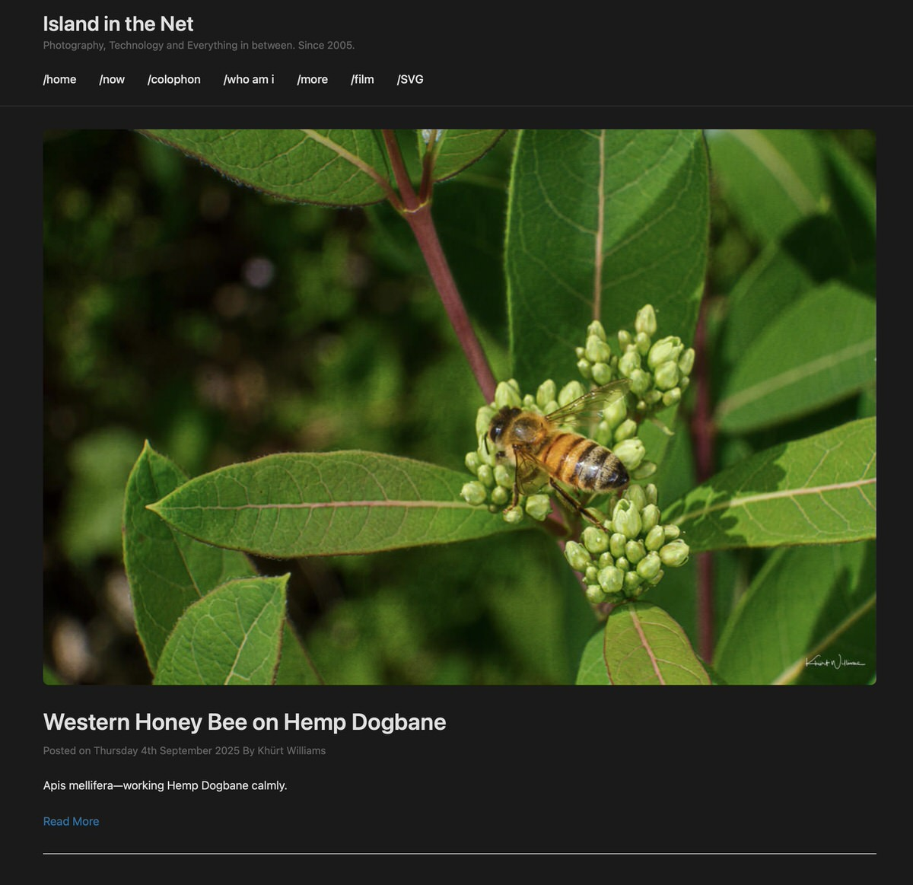

# IndieWeb Minimalist WordPress Theme

A minimalist WordPress theme with full IndieWeb support, microformats2 markup, ActivityPub compatibility, and Webmentions integration.
 


## Features

### IndieWeb Support
- **Microformats2 markup** (h-card, h-entry)
- **Representative h-card** for identity
- **Webmentions** display and styling
- **ActivityPub** likes and boosts display
- **Syndication links** (u-syndication)
- Passes [IndieWebify.me](https://indiewebify.me/) validation

### WordPress Features
- Responsive mobile-first design
- Custom logo and header support
- Custom colours and backgrounds
- Threaded comments with microformats2
- Sticky posts highlighting
- Featured images
- Translation ready
- Footer widget areas (3 sections)
- Custom menus
- Theme customiser integration
- Accessibility features (ARIA labels, screen reader text)
- Dark mode support
- Print styles

## Requirements

- WordPress 5.0 or higher
- PHP 7.4 or higher
- Recommended plugins:
  - [ActivityPub](https://wordpress.org/plugins/activitypub/) (v7.4.0+)
  - [Webmention](https://wordpress.org/plugins/webmention/)
  - [IndieAuth](https://wordpress.org/plugins/indieauth/)
  - [Syndication Links](https://wordpress.org/plugins/syndication-links/)

## Installation

### Via GitHub

1. Download the theme ZIP file from [Releases](../../releases)
2. In WordPress admin, go to **Appearance → Themes → Add New → Upload Theme**
3. Upload the ZIP file
4. Click **Install Now**
5. Activate the theme

### Via Git Clone

```bash
cd wp-content/themes/
git clone https://github.com/khurtwilliams/indieweb-minimalist.git
```

Then activate via **Appearance → Themes** in WordPress admin.

## Configuration

### 1. Set Up Your Identity

1. Go to **Users → Your Profile**
2. Fill in your **Display Name** and **Biographical Info**
3. These will appear in your representative h-card

### 2. Configure Theme Settings

Go to **Appearance → Customise**:

- **Site Identity**: Set your site title and tagline
- **Custom Logo**: Upload your logo (used as u-photo in h-card)
- **Social Links**: Add up to 5 social profile URLs (will have rel="me")
- **Author Bio**: Toggle author bio display on posts

### 3. Enable IndieWeb Features

#### ActivityPub Setup
1. Install and activate the ActivityPub plugin
2. Go to **Settings → ActivityPub**
3. Enable "Receive likes" and "Receive reblogs (boosts)"
4. Your posts will federate to Mastodon and other Fediverse platforms

#### Webmentions Setup
1. Install and activate the Webmention plugin
2. Webmentions will display in the comments section
3. The theme provides proper microformats2 markup for webmention discovery

#### Syndication Links
1. Install the Syndication Links plugin
2. When editing posts, add syndication URLs in the meta box
3. Links display with proper u-syndication markup

### 4. Set Up Menus

1. Go to **Appearance → Menus**
2. Create a menu and assign it to **Primary Menu**
3. The theme supports nested sub-menus

### 5. Configure Widgets

Go to **Appearance → Widgets** to add content to three footer widget areas.

## IndieWeb Validation

This theme passes all IndieWebify.me tests:

- ✅ Representative h-card with photo, name, URL, and bio
- ✅ h-entry markup on posts
- ✅ Author information with h-card
- ✅ Proper syndication links (u-syndication)
- ✅ URL structure (u-url, u-uid)

Test your site at: https://indiewebify.me/

## ActivityPub Interactions

The theme displays Fediverse interactions (likes and boosts) after post content:

- Shows avatar count for likes
- Shows avatar count for boosts  
- Avatars link to Fediverse profiles
- Automatically updates as interactions come in

## Customisation

### Child Theme

For customisations, create a child theme:

```php
/* Child Theme style.css */
/*
Theme Name: IndieWeb Minimalist Child
Template: indieweb-minimalist
*/

@import url("../indieweb-minimalist/style.css");

/* Your customisations here */
```

### Custom CSS

Add custom CSS via **Appearance → Customise → Additional CSS**

## Browser Support

- Chrome/Edge (latest)
- Firefox (latest)
- Safari (latest)
- Mobile browsers

## Accessibility

- ARIA labels for navigation
- Screen reader text for hidden elements
- Keyboard navigation support
- High contrast mode support
- Reduced motion support

## Credits

- Created by [Khürt Williams](https://islandinthenet.com/)
- Built for the [IndieWeb](https://indieweb.org/) community
- Inspired by IndieWeb principles and the open web

## Contributing

Contributions are welcome! Please:

1. Fork the repository
2. Create a feature branch (`git checkout -b feature/improvement`)
3. Commit your changes (`git commit -am 'Add new feature'`)
4. Push to the branch (`git push origin feature/improvement`)
5. Create a Pull Request

## Support

- **Issues**: Report bugs via [GitHub Issues](../../issues)
- **Documentation**: See [IndieWeb Wiki](https://indieweb.org/)
- **Community**: Join [IndieWeb Chat](https://chat.indieweb.org/)

## Changelog

See [CHANGELOG.md](CHANGELOG.md) for version history.

## Licence

This theme is licenced under the GPL v2 or later.

```
Copyright (C) 2025 Khürt Williams

This program is free software; you can redistribute it and/or modify
it under the terms of the GNU General Public Licence as published by
the Free Software Foundation; either version 2 of the Licence, or
(at your option) any later version.
```

See [LICENSE](LICENSE) for full details.

## Links

- [IndieWeb](https://indieweb.org/)
- [Microformats2](http://microformats.org/wiki/microformats2)
- [ActivityPub](https://activitypub.rocks/)
- [Webmention Spec](https://www.w3.org/TR/webmention/)
